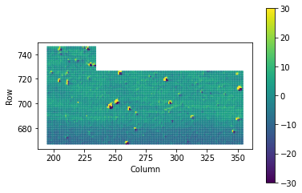
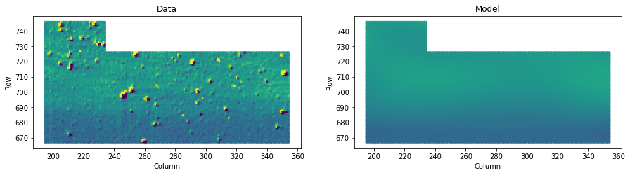

# Example `KBackground.Estimator` workflow with K2 Campaign 8

In this notebook we show how to use the `KBackground` tool to estimate rolling band. You can see a video of the rolling band in this dataset [here](https://www.youtube.com/watch?v=cAc70ErIsSQ).


```python
import lightkurve as lk
import numpy as np
import matplotlib.pyplot as plt
from kbackground import Estimator
from astropy.io import fits
from astropy.table import Table
```

First we are going to get a number of the TPFs in a large superstamp in campaign 8. This will let us see a patch of data with a rolling band.


```python
tpfs = []
for idx in np.arange(656, 656 + 26):
    tpfs.append(lk.search_targetpixelfile(f"EPIC 200068{idx}", mission='k2').download())
```

Next we will extract the row, column and flux values from all the TPFs.


```python
rows, columns, fluxs, cadencenos = [], [], [], []
for tpf in tpfs:
    column, row = np.meshgrid(np.arange(tpf.column, tpf.shape[2] + tpf.column), np.arange(tpf.row, tpf.shape[1] + tpf.row))
    aper = np.ones(tpf.shape[1:], bool)
    rows.append(row[aper])
    columns.append(column[aper])
    fluxs.append(tpf.flux.value[:, aper])
    cadencenos.append(tpf.cadenceno)
```

Next we can build the `Estimator` object, passing in the row, column, and flux values from all the TPFs.


```python
e = Estimator(np.hstack(rows), np.hstack(columns), np.hstack(fluxs))
```

Under the hood, `KBackground` works on the median subtracted frames, below we plot a median subtracted frame which shows a rolling band.


```python
plt.scatter(np.hstack(columns), np.hstack(rows), s=1, c=e.flux[870] - np.median(e.flux, axis=0)[None, :], vmin=-30, vmax=30)
plt.gca().set_aspect('equal')
plt.colorbar()
plt.xlabel('Column')
plt.ylabel('Row')
```


    Text(0, 0.5, 'Row')


    

    


We can access the model for any frame using


```python
e.model(870)
```


    array([[-8.94488385, -8.90010893, -8.85651596, ...,  1.85081812,
             1.82138717,  1.79143639]])


Or a subset using


```python
e.model([40, 45, 60])
```


    array([[ 1.93017667,  1.93036882,  1.93314686, ..., -8.22085331,
            -8.33684017, -8.44635708],
           [ 2.99220081,  2.90720597,  2.82639621, ..., -3.5237907 ,
            -3.72663853, -3.93185723],
           [ 1.51809432,  1.53582628,  1.5549011 , ..., -4.24615096,
            -4.42367603, -4.60262413]])


Or all the frames


```python
e.model()
```


    array([[ 2.18996486,  2.14205685,  2.09592344, ..., -1.4469243 ,
            -1.69334142, -1.94635625],
           [ 3.13098093,  3.07801362,  3.0268184 , ..., -1.07090413,
            -1.32889698, -1.59270205],
           [ 2.33960018,  2.30934775,  2.2801225 , ..., -2.17809658,
            -2.45870387, -2.74516339],
           ...,
           [ 1.99350482,  2.04293315,  2.09124255, ..., 13.61719876,
            13.65121988, 13.67418062],
           [ 1.88728895,  1.91152565,  1.9358563 , ..., 13.63447609,
            13.73234197, 13.8205855 ],
           [ 2.37570386,  2.40964525,  2.44330664, ..., 13.38644446,
            13.45787915, 13.51934373]])


We can plot the model for the same frame above.


```python
tdx = 890
fig, ax = plt.subplots(1, 2, figsize=(15, 4))
ax[0].scatter(np.hstack(columns), np.hstack(rows), s=5, c=e.flux[tdx] - np.median(e.flux, axis=0)[None, :], vmin=-30, vmax=30)
ax[0].set_aspect('equal')
ax[0].set(title='Data', xlabel='Column', ylabel='Row')
ax[1].scatter(np.hstack(columns), np.hstack(rows), s=5, c=e.model(tdx), vmin=-30, vmax=30)
ax[1].set_aspect('equal')
ax[1].set(title='Model', xlabel='Column', ylabel='Row')
```


    [Text(0.5, 1.0, 'Model'), Text(0.5, 0, 'Column'), Text(0, 0.5, 'Row')]


    

    

